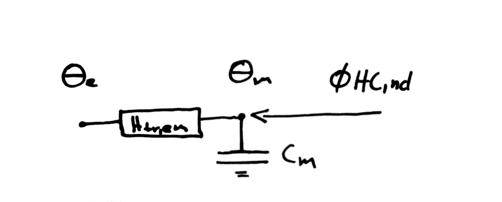

# Simple Simple

> Your dream house come true!

A simple Building Energy Model written in Python.

## Conceptual Model

The model is derived from the hourly dynamic model in ISO 13790. It has only one capacity and
one resistance.

Compared to the ISO 13790 there is

* no internal heat gain,
* full shading of the building, no direct or indirect sun light,
* no windows or doors,
* no ventilation,
* immediate heat transfer between air and surface.



&theta;<sub>m,t</sub> = &theta;<sub>m,t-1</sub> &#215; (1 - &Delta;t / C<sub>m</sub> &#215; H<sub>tr, em</sub>) +  &Delta;t / C<sub>m</sub> &#215; (&Phi;<sub>HC, nd, t-1</sub> + H<sub>tr, em</sub> &#215; &theta;<sub>e, t-1</sub>)

### Output Variables

* &Phi;<sub>HC, nd, t</sub>: cooling or heating power at time t

### State Variables

* &theta;<sub>m, t</sub>: building temperature [℃] at time t

### Parameters

* &theta;<sub>e, t</sub>: outside temperature [℃] at time t
* A<sub>f</sub>: conditioned floor area [m<sup>2</sup>]
* C<sub>m</sub>: capacity of the building's heat mass [J/K]
* &Delta;t: time step size [s]
* H<sub>tr, em</sub>: heat transmission to the outside [W/K]
* &theta;<sub>int, C, set</sub>: cooling set point temperature [℃]
* &theta;<sub>int, H, set</sub>: heating set point temperature [℃]
* &Phi;<sub>C, max</sub>: maximum cooling power [W]
* &Phi;<sub>H, max</sub>: maximum heating power [W]

## User Guide

### Installation

You need Python 3.6 and pip installed.

Install from GitHub (needs Git):

    $ pip install git+git://github.com/timtroendle/simple-simple

If you don't have Git installed, download and extract the repository and then execute:

    $ cd <simple-simple-directory>
    $ pip install -e .

### Usage Example

```Python
from datetime import timedelta
from simplesimple import Building

conditioned_floor_area = 100
building = Building(
    heat_mass_capacity=165000 * conditioned_floor_area,
    heat_transmission=200,
    maximum_cooling_power=-10000,
    maximum_heating_power=10000,
    initial_building_temperature=16,
    time_step_size=timedelta(minutes=10),
    conditioned_floor_area=conditioned_floor_area
)

# simulate one time step
print(building.current_temperature) # returns 16
building.step(outside_temperature=20, heating_setpoint=18, cooling_setpoint=26)
print(building.current_temperature) # returns ~16.4
```

## Developer Guide

### Installation

Best install simplesimple in editable mode:

    $ pip install -e .

### Run the test suite

Run the test suite with py.test:

    $ py.test
